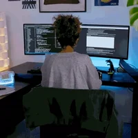

<h1 align="center">Glad to meet you! Welcome to my GitHub profile </h1>
<ul>
    <li>🏢 I'm currently a student</li>
    <li>💜 I'm passionate about Mathematics and CS Algorithms</li>
    <li>🤝 I like to collaborate with people</li>
    <li>🐕 I'm an animal lover, huge 🐍 Python fanboy</li>
</ul>

    
<h2 style="padding-bottom:0px">How to reach me? 📬</h2>

     
    
    
    
    

<h1 align="center">Let's Talk Work </h1>
<ul>
    <li>📚 I'm currently an undergraduate</li>
    <li>🏫 I completed my higher secondary at <a href="https://dpsguwahati.org/">Delhi Public School, Guwahati</a></li>
    <li>🤔 To know more about my work checkout my <a href="">Resume</a></li>
</ul>

    
<h2 style="padding-bottom:0px">Languages👨‍💻 and Tools⚒</h2>

     
    &nbsp;&nbsp;&nbsp;&nbsp;&nbsp;&nbsp;&nbsp;&nbsp;&nbsp;&nbsp;&nbsp;&nbsp;&nbsp;&nbsp;&nbsp;
     
    &nbsp;&nbsp;&nbsp;&nbsp;&nbsp;&nbsp;&nbsp;&nbsp;&nbsp;&nbsp;&nbsp;&nbsp;&nbsp;&nbsp;&nbsp;
     
    &nbsp;&nbsp;&nbsp;&nbsp;&nbsp;&nbsp;&nbsp;&nbsp;&nbsp;&nbsp;&nbsp;&nbsp;&nbsp;&nbsp;&nbsp;

    
<h2 style="padding-bottom:0px">📈 GitHub Stats</h2>

     
    

        
        
    

